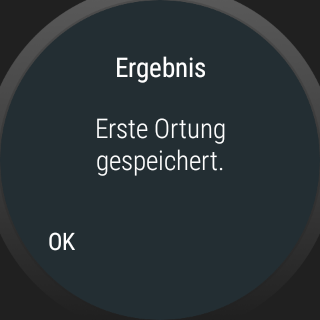
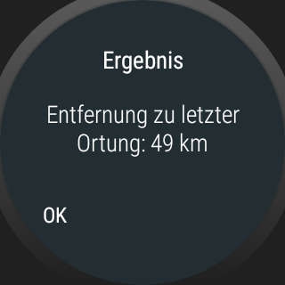

# WearOS-App: "GPS-Entfernung" #

Android-Studio-Project for a WearOS-App to be used for measuring the distance between two
locations based on the GPS location.

 

----
# Screenshots #

  

 

----
# License #

See the [LICENSE file](LICENSE.md) for license rights and limitations (BSD 3-Clause License).
